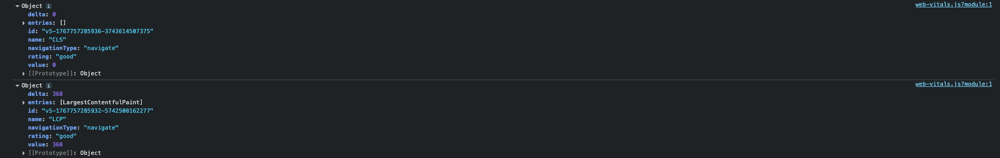
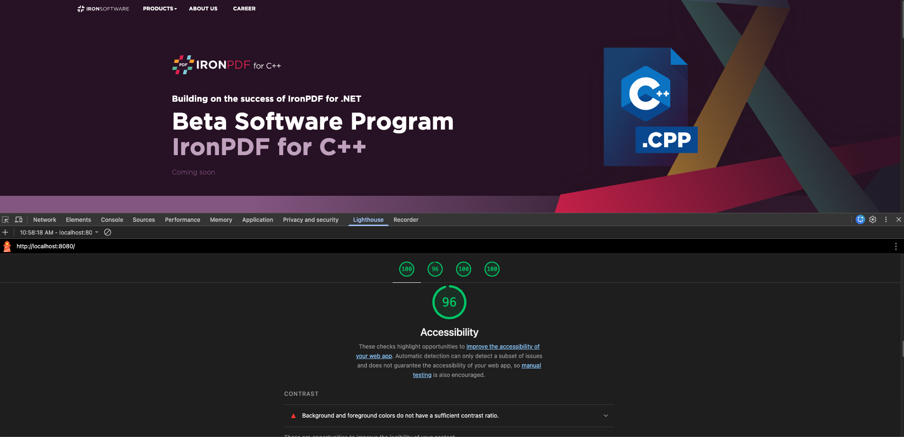

# QA Checklist

## 1. Pixel Alignment & Spacing (Figma Comparison)

**Objective:** Ensure the implementation matches the Figma design as closely as possible.

Compared layout, spacing, and alignment against the Figma design using Figma Pixel Preview / overlay comparison.

**Verified:**
- Section paddings and margins
- Grid alignment and column widths
- Card dimensions, border radii, and spacing
- Alignment of text, buttons, badges, and icons
- Confirmed no unintended layout shifts between sections.
- Decorative background elements and glows visually match the design while remaining responsive.
- No layout implemented using absolute positioning for structural content (absolute positioning used only for decorative elements).
- Used PerfectPixel chrome extension to verify.

✅ **Result:** Pixel-perfect match at design breakpoint with consistent spacing across sections.

## 2. Typography Accuracy

**Objective:** Validate typography consistency with Figma specifications.

Verified font family usage (Gotham).

**Confirmed:**
- Font sizes
- Font weights (light, regular, bold, black)
- Line heights
- Letter spacing

**Ensured correct heading hierarchy:**
- Single `<h1>` in hero section
- `<h2>` used for section headings
- Checked color contrast and readability on dark backgrounds.

✅ **Result:** Typography matches Figma specifications and maintains readability across devices.

## 3. Responsiveness & Breakpoints

**Objective:** Ensure the page adapts correctly across screen sizes.

**Tested responsive behavior at the following breakpoints:**
- ≥1200px — Desktop / Large screens
- 992px — Small desktop / Large tablet (Bootstrap “lg”)
- 768px — Tablet (Bootstrap “md”)
- ≤576px — Mobile devices (Bootstrap “sm” and below)

**Verified:**
- Layout reflows without horizontal scrolling
- Navigation collapses correctly on smaller screens
- Cards stack vertically at smaller widths
- Images scale proportionally
- Forms remain usable and accessible on mobile
- Responsive behavior was implemented using Bootstrap grid and flexbox, without relying on fixed positioning.

✅ **Result:** Fully responsive across all tested breakpoints with no layout issues.

## 4. Cross-Browser Testing

**Objective:** Ensure consistent behavior across major browsers.

**Tested on:**
- Google Chrome (latest)
- Mozilla Firefox (latest)
- Safari (latest)

**Checked:**
- Layout consistency
- Font rendering
- Flexbox/grid behavior
- Button and form interactions

✅ **Result:** Consistent appearance and behavior across tested browsers.

## 5. SEO Validation

**Objective:** Confirm basic on-page SEO best practices.

**Verified:**
- `<title>` and `<meta name="description">` present and populated dynamically
- Proper heading hierarchy (h1 → h2)
- All meaningful images include descriptive alt attributes
- Decorative images use empty alt or `aria-hidden="true"`
- Semantic HTML elements (header, main, section, nav) used appropriately

✅ **Result:** Meets basic SEO and semantic HTML requirements.

## 6. Core Web Vitals Considerations

**Objective:** Ensure good performance and user experience metrics.

**Actions taken:**
- Used the web-vitals library to measure Core Web Vitals during development.
- Verified strong results for:
  - **CLS (Cumulative Layout Shift):** No visible layout shifting on load.
  - **LCP (Largest Contentful Paint):** Optimized hero content and images.
  - **FID / INP:** Minimal JavaScript usage to ensure fast interactivity.
- Explicit width and height attributes applied to large images to prevent layout shift.
- Font loading optimized using `font-display: swap`.

Screenshots of Core Web Vitals results are included as part of the submission.

✅ **Result:** Core Web Vitals within recommended thresholds.

## 7. Lighthouse Audit

**Objective:** Validate overall quality and performance.

Ran Google Lighthouse audits in Chrome DevTools.

**Checked the following categories:**
- Performance
- Accessibility
- Best Practices
- SEO

Reviewed recommendations and confirmed no critical issues affecting usability or performance.

Screenshots of Lighthouse audit results are included in the submission.

✅ **Result:** Strong Lighthouse scores with no major warnings.

